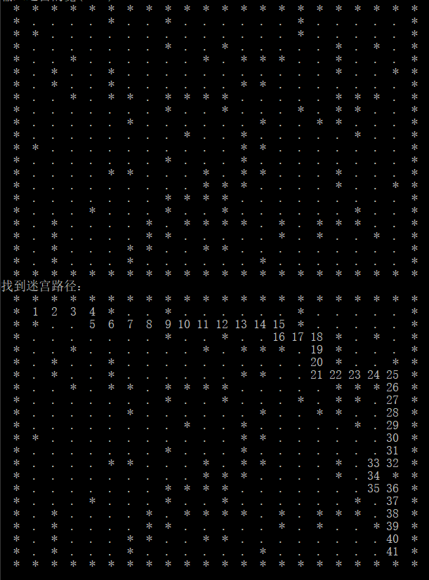

# Maze  

    

使用DFS实现字符迷宫，提供默认和自定义迷宫大小。
## Code  
```
int migong::get(node start,node end)//求迷宫路径
{
	//入口 出口不通
	if(arr[1][1]==1||arr[end.x][end.y]==1)
	{
		return 0;
	}
	stack <node> s;
	node curpos;
	curpos=start;
	int curstep=1;
	do{
		if(arr[curpos.x][curpos.y]==0)//是通路
		{
			arr[curpos.x][curpos.y]=curstep;//足迹
			curpos.direction=0;//方向
			s.push(curpos);
			curstep++;
			if(curpos.x==end.x&&curpos.y==end.y)
				return 1;
			curpos=getnext(curpos,curpos.direction);
		}
		else//不是通路
		{
			if(!s.empty())
			{
				curpos=s.top();
				s.pop();
				curstep--;
				while(curpos.direction==3&&!s.empty())
				{
					arr[curpos.x][curpos.y]=-1;
					curpos=s.top();
					s.pop();
					curstep--;
				}
				if(curpos.direction<3)
				{
					curpos.direction++;
					s.push(curpos);
					curstep++;
					curpos=getnext(curpos,curpos.direction);
				}}}
	}while (!s.empty());
	return 2;//无法到达终点
}  
```  
## Screenshots  


## ChangeLog  
[ChangeLog](https://github.com/sikuquanshu123/Maze/releases)
